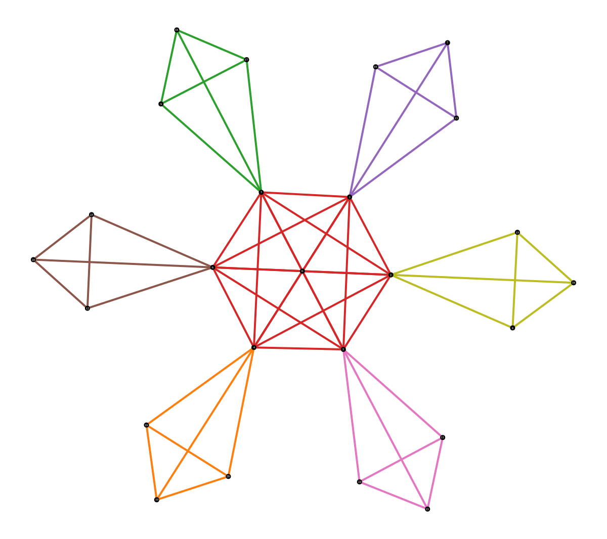

# Hierarchical core-periphery structure in networks

This code is an implementation of our model for hierarchical core-periphery structure in networks as presented in this [paper](https://arxiv.org/abs/2301.03630).

## Disclaimer
The code has only been tested with C++17 and compiled with Apple clang version 14.0.0. The application requires the C++17 standard and the GNU Scientific Library (GSL) 2.7.1

## Usage

````
> git clone https://github.com/apolanco115/hcp
> cd hcp
> mkdir build && cd build
> cmake ../
> make
````

The application takes a parameters file as a command-line argument. Once the application has been compiled you can run it using the following command:
````
> ./hcp ../parameters.txt
````

The parameters file can take on any name, however, it must be the first command-line argument.

The following are the only parameters the applications recognizes
| Parameter            | Description                                       | Required    | Default Value                |
| -----------          | -----------                                       | ----------- | -----------                  |
| `gml_path`             | path to gml file                                  | True        | none                         |
| `max_itr`              | maximum number of monte carlo steps               | False       | 1000000000                   |
| `max_num_groups`       | maximum number of groups                          | False       | 64                           |
| `initial_num_groups`   | number of groups to initialize simulation with    | False       | 2                            |
| `initial_group_config` | group configuration to initialize simulation with | False       | empty `std::vector<uint64_t>`|
| `saved_data_name`      | name to prepend saved data files with             | False       | `"data"`                     |
| `save_directory`       | location where data will be saved to              | False       | current working directory    |

`gml_path` is a required parameter and it must point to a `.gml` file. No other network file format is supported.

The `initial_group_config` parameter should be given as a list of decimal numbers representing the binary string of the node group configurations. For example, suppose there are 4 groups and a node is in group 0, 2, and 3 (i.e. `{1, 0, 1, 1}`), taking the right most bit as the most significant bit, the node's decimal representation is 13 (thirteen).

### Example
For an 8 node network with initial group configuration
````
g = {{1,1,0},
     {1,1,0},
     {1,1,0},
     {1,1,0},
     {1,0,1},
     {1,0,1},
     {1,0,1},
     {1,1,1}}
````
The `initial_group_config` parameter should be given as follows:
````
initial_group_config: 3 3 3 3 5 5 5 7
````

Note: Your initial group configuration is constrained by your `initial_num_groups`. If you initialize with 2 groups, but also input the number `15` as a group configuration, this would lead to undefined behavior, as `15` would imply there are 4 groups (`{1,1,1,1}`). The code **does not** check this. Similarly, the configurations saved by the code (`*_configs.txt`) is not enough to uniquely determine a state; you must use the accompanying `*_num_groups.txt` file in addition to `*_configs.txt`. 


 


